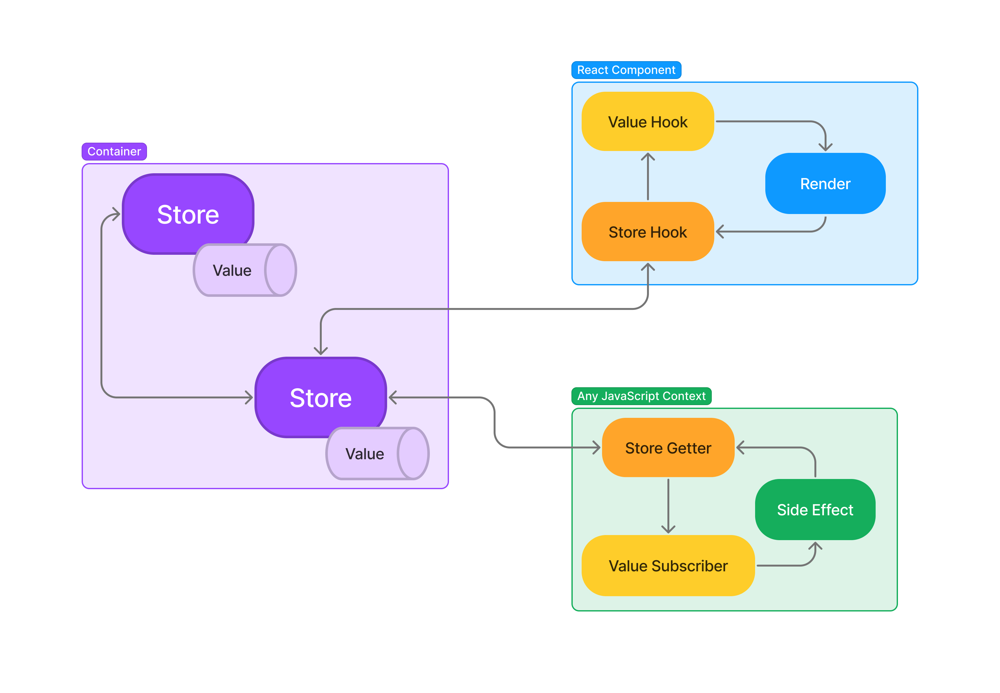

# App's Digest

A simple state management library for JavaScript applications based in the publisher-subscriber and IoC container patterns.

> Yes, the library name was inspired by the general-interest subscription-based magazine, Reader's Digest.

[](https://openbase.com/js/apps-digest?utm_source=embedded&amp;utm_medium=badge&amp;utm_campaign=rate-badge)

## Table of contents

- [Prerequisites](#prerequisites)
- [Installation](#installation)
- [A Quick Example](#a-quick-example)
- [Description](#description)
- [Detailed Usage](#detailed-usage)
- [Persistency](#persistency)
- [Author](#author)
- [License](#license)

## Prerequisites

- Node >= 12
- React >= 16.9.0 (Optional)

## Installation

```sh
npm install apps-digest
```

## A quick example

```javascript
// Counter Store
import { AppsDigestValue, generateStoreDefinition } from 'apps-digest';

class CounterStore {
  static getStoreName() {
    return "CounterStore";
  }

  count = new AppsDigestValue(0);

  increment() {
    const currentCount = this.count.currentValue();
    this.count.publish(currentCount + 1);
  }
}

export default generateStoreDefinition(CounterStore);

// Counter View
import React from 'react';
import ReactDOM from 'react-dom';
import { useAppsDigestStore, useAppsDigestValue } from 'apps-digest';
import CounterStore from './CounterStore';

const CounterView = () => {
  const counterStore = useAppsDigestStore(CounterStore);
  const count = useAppsDigestValue(counterStore.count);

  <button onClick={() => counterStore.increment()}>
    Current Count: {count}
  </button>;
};

ReactDOM.render(<CounterView />, document.body);
```

## Description

App's Digest leverages on two software architecture patterns:

- IoC Container pattern (a.k.a. DI Container) to manage store instantiation, dependency injection and lifecycle.
- The publisher-subscriber pattern to implement values within the stores that any JavaScript context (including React components) can subscribe and publish to.



### What's a Store?

A store is essentially a bucket of values that other JavaScript objects can subscribe and publish to. The stores live as long as they have at least one reference in the container. Once the last reference of a store is removed, the store is disposed.

## Detailed Usage

Let's take a closer look on how to use the library.

### Create a store

First, let's create our store. A store is a class that implements the following:
- Static method `getStoreName` that returns the unique store name (required).
- Store value(s) by instantiating `AppsDigestValue` with an initial value (required).
- Value setters that publish (updates) the store values (optional).

Once the store has been created, we need to generate the store definition, which will be used by the container to identify our store in memory.

```javascript
import { AppsDigestValue, generateStoreDefinition } from 'apps-digest';

class CounterStore {
  static getStoreName() {
    return "CounterStore";
  }

  count = new AppsDigestValue(0);

  increment() {
    const currentCount = this.count.currentValue();
    this.count.publish(currentCount + 1);
  }
}

export default generateStoreDefinition(CounterStore);
```

### Use the store anywhere

Now that we have our store, we can use it anywhere within a JavaScript application by getting its instance via the container.

```javascript
import { AppsDigestContainer } from 'apps-digest';
import CounterStore from './CounterStore';

// get the container and store instances
const storeContainer = AppsDigestContainer.getInstance();
const counterStore = storeContainer.get(CounterStore);

// subscribe to the value
const subscriberId = counterStore.count.subscribe((count) => {
  console.log(`Current Count: ${count}`);
});

// publish to the value
counterStore.increment();
counterStore.increment();
counterStore.increment();

// unsubscribe from the value
counterStore.count.unsubscribe(subscriberId);

// dispose the store
storeContainer.remove(CounterStore);
```

### Use the store in a React Component

All right, let's use our store in a UI using React (we'll support frameworks in the future).

First we need to get our store instance by using the `useAppsDigestStore`. Then we can use the hook `useAppsDigestValue` to subscribe to the store value and trigger the side effects (render).

By using these hooks, we get automatic value un-subscription and store disposal for free when the component is unmounted.

```javascript
import React from 'react';
import ReactDOM from 'react-dom';
import { useAppsDigestStore, useAppsDigestValue } from 'apps-digest';
import CounterStore from './CounterStore';

const CounterView = () => {
  const counterStore = useAppsDigestStore(CounterStore);
  const count = useAppsDigestValue(counterStore.count);

  <button onClick={() => counterStore.increment()}>
    Current Count: {count}
  </button>;
};

ReactDOM.render(<CounterView />, document.body);
```

### Store injection (dependency)

It's important for all applications to follow software design principles, specifically separation of concerns and segregation.

With App's Digest, we can have segregated stores that contain a small meaningful portion of the application's state, and then leverage the container to inject stores into main stores.

Let's say we have a store that needs to read the count value from our `CounterStore`. We can easily inject the store like this:

```javascript
import {
  AppsDigestValue,
  AppsDigestStore,
  generateStoreDefinition,
} from 'apps-digest';
import CounterStore from './CounterStore';

class ApplicationStore extends AppsDigestStore {
  counterStore = this.inject(CounterStore);
  isMax = new AppsDigestValue(false);

  static getStoreName() {
    return "ApplicationStore";
  }

  constructor() {
    super();

    this.subscribeToStoreValue(this.counterStore.count, (count) => {
      if (!this.isMax.currentValue() && count >= 10) {
        this.isMax.publish(true);
      }
    });
  }
}

export default generateStoreDefinition(ApplicationStore);
```

By extending from `AppsDigestStore`, we get the automatic un-subscription for free when the store is disposed.

## Persistency

In order to persist a store value, we need to specify the persist key we would like to use (has to be unique) in the second argument of `AppsDigestValue`.

Every time the value is published, the value will be persisted. And, the next time the store is instantiated, the value will be rehydrated.

```javascript
  // assuming CountValue was persisted as 2, count will be hydrated with 2 instead of 0
  count = new AppsDigestValue(0, 'CountValue');

  // this will persist the new value
  this.count.publish(currentCount + 1);
```

## Author

- **Marty Roque**
  - GitHub: [@martyroque](https://github.com/martyroque)
  - Twitter: [@lmproque](https://twitter.com/lmproque)

## License

[ISC License](LICENSE)

Copyright © 2022 [Marty Roque](https://github.com/martyroque).
